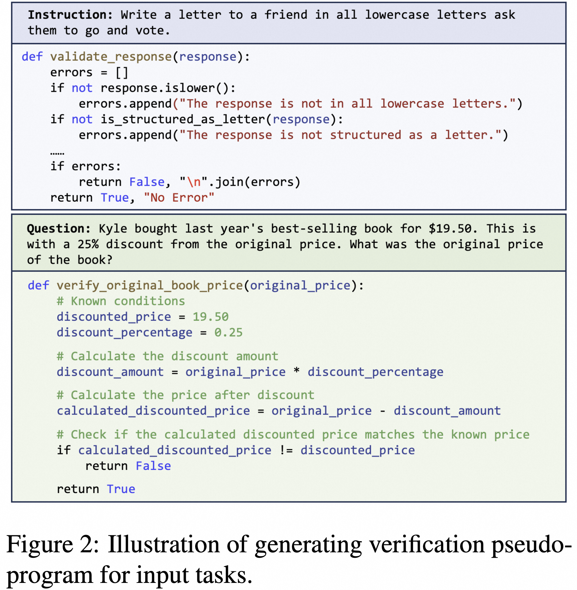
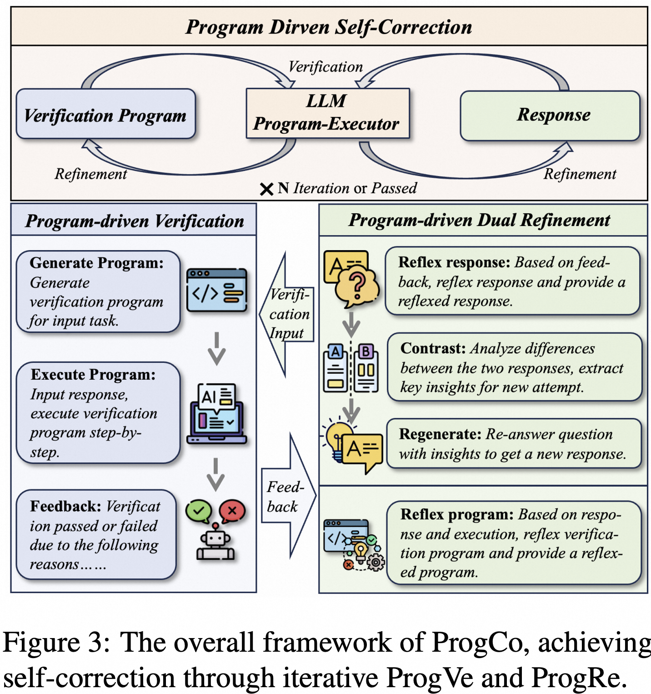
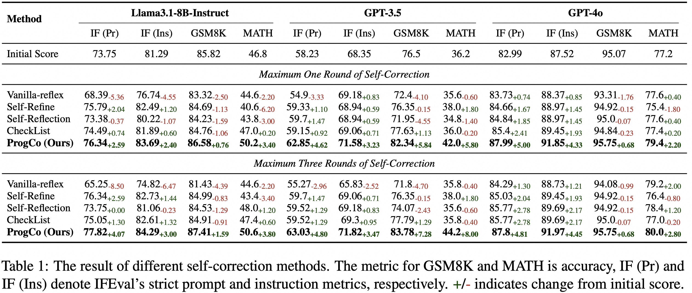

# ProgCo: Program Helps Self-Correction of Large Language Models

 

This repository contains the official implementation of ["ProgCo: Program Helps Self-Correction of Large Language Models"](https://arxiv.org/abs/2501.01264), a novel framework that enhances LLMs' self-correction capabilities through program-guided verification and refinement. This paper has been accepted to appear at **ACL 2025** as a **main** conference paper.

## 📖 Introduction

Large Language Models (LLMs) often struggle with effective self-correction in complex reasoning tasks due to unreliable self-verification and refinement processes. ProgCo addresses this challenge through two key innovations:

1. **Program-driven Verification (ProgVe)**  
   Enables LLMs to self-generate and self-execute verification pseudo-programs that validate responses using code-structured logic and reverse reasoning.
  


2. **Program-driven Refinement (ProgRe)**  
   Implements dual reflection mechanisms that optimize both responses and verification programs simultaneously, mitigating error propagation.



## ✨ Key Features

- 🧩 **Pseudo-Program Verification**: Leverage LLMs' code understanding for complex constraint checking
- 🔄 **Dual Refinement Mechanism**: Joint optimization of responses and verification programs
- 🧠 **Symbolic Tool Integration**: Compatible with Python executors for enhanced numerical validation
- 📈 **Iterative Improvement**: Progressive enhancement through multiple correction rounds

## 📊 Results



Results show significant improvements over baseline methods on instruction-following and mathematical reasoning tasks.

## 📦 Installation

```bash
git clone https://github.com/songxiaoshuai/progco.git
cd progco
pip install -r requirements.txt
```

## 🚀 Quick Start

```bash
# Step 1: Configure Project Path and Model API Settings in run.sh
export PROJECT_PATH="progco_project_path"
export OPENAI_API_KEY="your_api_key"
export OPENAI_BASE_URL="your_api_base"

# Step 2: Generate Initial Inference Responses
python MATH/get_first_response.py --model=gpt-4o-0806

# Step 3: Execute ProgCo Main Program
# Parameters:
# max_cur_turn: Maximum number of self-correction iterations
# start: Starting index of the evaluation dataset slice (default: 0)
# end: Ending index of the evaluation dataset slice (default: -1 for entire dataset)
python ifeval/progco_infer_main.py --model=gpt-4o-0806 --max_cur_turn=3 --start=0 --end=-1

# Step 4: Evaluate Inference Results
python ifeval/progco_eval_main.py --infered_file_path=ifeval/logs/gpt-4o-0806/infered/your_infered_file_name.json
```

## 🔧 Enhance Validation Using  Real Python Tool 

Due to the advantage of program easily integrating with symbolic tools, we further indicate in Prompt that LLM-executor can delegate complex numerical operations to an actual python tool to overcome the shortcomings of LLM. This can further improves ProgCo’s performance.

```bash
# Step 1: Deploy Python API Service
python code_interpreter/pack_api.py

# Step 2: Test API Service Availability
python code_interpreter/request_api.py

# Step 3: Run ProgCo Main Program
python ifeval/progco_infer_main_with_python_tool.py --model=gpt-4o-0806 --max_cur_turn=3 --start=0 --end=-1
```


## 📚 Citation

If you use ProgCo in your research, please cite our work:

```bibtex
@article{song2025progco,
  title={ProgCo: Program Helps Self-Correction of Large Language Models},
  author={Song, Xiaoshuai and Wu, Yanan and Wang, Weixun and Liu, Jiaheng and Su, Wenbo and Zheng, Bo},
  journal={arXiv preprint arXiv:2501.01264},
  year={2025}
}
```

---

**Contact**: For questions and suggestions, please contact Xiaoshuai Song at [lixing.wyn@alibaba-inc.com](mailto:songxiaoshuai.sxs@alibaba-inc.com) or Yanan Wu at [lixing.wyn@alibaba-inc.com](mailto:lixing.wyn@alibaba-inc.com).
